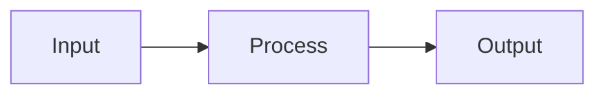
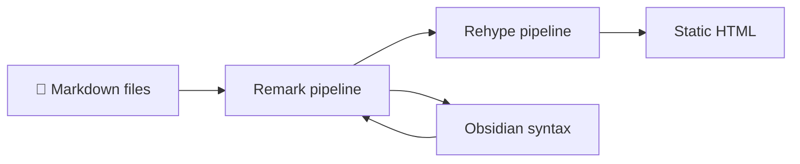
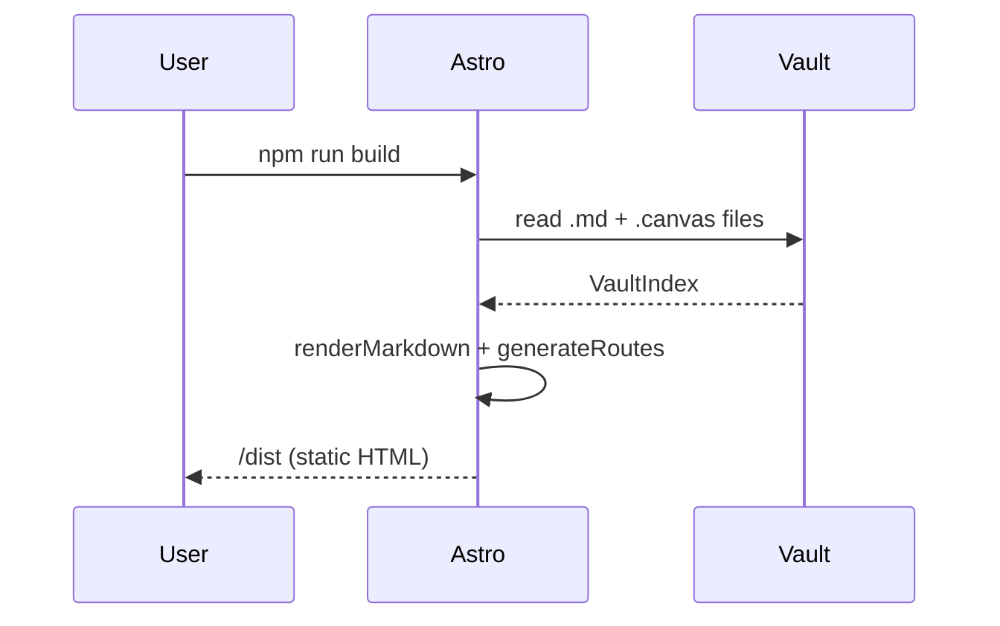

# Components

Obsidian Site supports the full Obsidian Markdown syntax plus standard GitHub-Flavored Markdown. This page documents every component you can use in your notes.

## Headings

```markdown
# Heading 1
## Heading 2
### Heading 3
#### Heading 4
```

## Text Formatting

```markdown
**Bold text**
*Italic text*
~~Strikethrough~~
==Highlighted text==
`Inline code`
```

Renders as: **Bold**, *Italic*, ~~Strikethrough~~, ==Highlighted==, `inline code`.

## Links

```markdown
[External link](https://obsidian.md)
[[Internal wikilink]]
[[Note Name|Custom label]]
[[Folder/Note]]
```

## Images

```markdown
![[_attachments/image.png]]
![[_attachments/image.png|300]]          (resize to 300px wide)
    (standard Markdown)
```

**Obsidian embed (full width):**

![[_attachments/demo.png]]

**With width constraint (`|300`):**

![[_attachments/demo.png|300]]

Images stored in your vault's `_attachments/` folder are automatically copied to the build output.

## Code Blocks

Fenced code blocks with syntax highlighting for 100+ languages:

````markdown
```typescript
function greet(name: string): string {
  return `Hello, ${name}!`;
}
```
````

A **Copy** button appears on hover in the top-right corner of every code block.

Supported language identifiers: `ts`, `js`, `python`, `rust`, `go`, `bash`, `sql`, `yaml`, `json`, `css`, `html`, `markdown`, and many more.

## Callouts

Obsidian-style callouts with optional titles:

```markdown
> [!note]
> A note callout.

> [!tip] Pro Tip
> Use callouts to highlight important information.

> [!warning] Watch out
> This might cause issues.

> [!danger]
> Destructive operation ahead.

> [!info] Did you know
> Callouts support **markdown** inside them.
```

Available types: `note`, `info`, `tip`, `success`, `warning`, `danger`, `error`, `question`, `example`, `quote`, `abstract`, `bug`, `todo`.

## Tables

```markdown
| Name    | Type   | Default |
|---------|--------|---------|
| siteName | string | `''`   |
| lang    | string | `'en'` |
```

## Tags

Add tags in frontmatter or inline in the note body:

```markdown
---
tags: [guide, setup]
---

This note is also tagged with #inline-tag.
```

Tags appear as clickable pills that open the search modal filtered to that tag.

## Frontmatter

YAML frontmatter at the top of a note:

```markdown
---
title: My Note Title
tags: [tag1, tag2]
icon: 🚀
author: Jane Doe
version: 1.2.0
---
```

The `title`, `tags`, and `icon` fields are used by the UI. All other fields are shown in the **Metadata** section at the bottom of the note.

## Blockquotes

```markdown
> This is a standard blockquote.
> It can span multiple lines.
```

## Task Lists

```markdown
- [x] Completed task
- [ ] Pending task
- [ ] Another item
```

## Wikilink Embeds

Embed the content of another note inline:

```markdown
![[My Other Note]]
```

> [!warning] Embed depth
> Embedded notes are rendered shallowly — nested embeds are not recursively expanded to avoid infinite loops.

## Horizontal Rule

```markdown
---
```

## Mermaid Diagrams

Use fenced code blocks with the `mermaid` language identifier to render diagrams.

````markdown

````

**Flowchart:**



**Sequence diagram:**



> [!tip] Supported diagram types
> Flowcharts, sequence diagrams, class diagrams, state machines, Gantt charts, pie charts, and more — anything supported by [Mermaid v11](https://mermaid.js.org).
